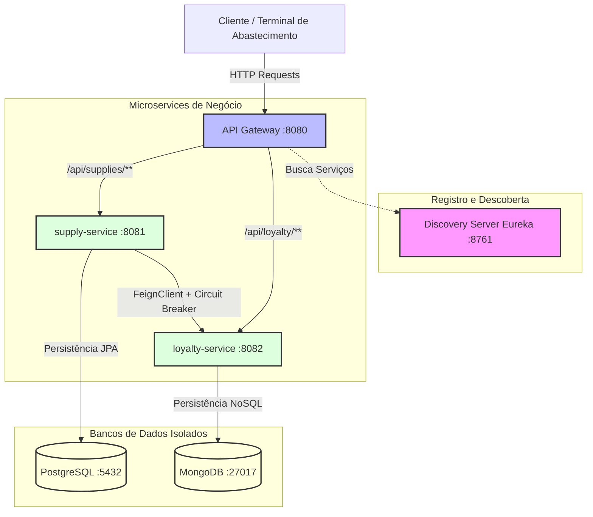

# Proposta e Arquitetura Inicial de Microservices
## Disciplina: Microsserviços e DevOps com Spring Boot e Spring Cloud
**Identificação da Turma:** [26E2_3]  
**Integrante:** Guilherme Duffes Marques  

---

## 1. Tema Escolhido e Descrição do Problema
O tema escolhido é o **GasStation Hub**, um sistema inteligente focado em postos de combustível. 

### O Problema
Em postos de combustível, a venda e o abastecimento na pista de abastecimento ocorrem em altíssima frequência e dependem de velocidade absoluta. Qualquer atraso no registro do abastecimento gera filas e prejuízos. Por outro lado, programas de fidelidade (onde clientes ganham pontos por litro abastecido) são fundamentais para retenção de clientes.
O grande problema é: **se o sistema de fidelidade estiver lento ou fora do ar, o registro do abastecimento na pista não pode parar.** 

### A Solução
Propõe-se uma arquitetura baseada em microservices onde o registro de abastecimentos (`supply-service`) e o sistema de fidelidade (`loyalty-service`) funcionam de forma independente, com seu próprio banco de dados isolado. Caso o serviço de fidelidade falhe, um mecanismo de resiliência intercepta o erro, permitindo que a venda seja concluída com sucesso e garantindo o funcionamento contínuo do posto.

---

## 2. Desenho da Arquitetura
A arquitetura é composta por um ponto de entrada único (API Gateway), um servidor de registro de serviços (Discovery Server) e dois microservices de negócio com bancos de dados isolados.

---

## 3. Definição dos Microservices

| Microservice | Responsabilidade Principal | Entidades Principais | Banco de Dados | Justificativa |
| :--- | :--- | :--- | :--- | :--- |
| **discovery-server** | Servidor de Registro (Eureka Server). | N/A | N/A | Permite a localização dinâmica das instâncias dos serviços sem IPs fixados no código. |
| **api-gateway** | Ponto de entrada e roteamento inteligente. | N/A | N/A | Centraliza as chamadas externas, gerencia o roteamento e evita expor portas internas à rede externa. |
| **supply-service** | Registro e faturamento de abastecimentos. | Abastecimento (`Supply`) | PostgreSQL | Garante a integridade referencial e transacional (ACID) crítica para dados de faturamento e vendas de combustível. |
| **loyalty-service** | Cadastro de clientes e saldo de pontos. | Fidelidade (`CustomerLoyalty`) | MongoDB | Suporta dados altamente flexíveis de clientes, cupons e campanhas dinâmicas, além de alta performance de leitura de pontos. |

---

## 4. Estrutura e Isolamento de Banco de Dados
Cada microsserviço gerencia sua própria persistência de forma 100% isolada, respeitando o padrão *Database-per-service*:
1. **supply-service**: Conecta-se ao **PostgreSQL** na base `gasstation_db`.
2. **loyalty-service**: Conecta-se ao **MongoDB** na base `loyalty_db`.

A separação lógica inicial é garantida via instâncias independentes configuradas no Docker Compose. A comunicação direta de dados ocorre apenas por chamadas de rede (API), nunca por compartilhamento de tabelas.

---

## 5. Justificativa Técnica do Banco Não-Relacional (MongoDB)
O **MongoDB** foi selecionado para o `loyalty-service` devido aos seguintes fatores:
- **Esquema Flexível (Schemaless):** A fidelização de clientes envolve diferentes tipos de promoções e recompensas. Alguns clientes podem ter apenas pontuações simples, outros podem possuir listas dinâmicas de cupons ativos, preferências de combustível, ou histórico de cashback. Um banco documental permite modelar essas coleções de forma flexível sem migrações de esquema dolorosas.
- **Leitura de Alta Performance:** A consulta ao saldo de pontos é feita no momento do pagamento na pista. Com o MongoDB, todo o perfil de fidelidade do cliente (incluindo o histórico recente de resgates) pode ser armazenado em um único documento aninhado, dispensando operações de `JOIN` dispendiosas.
- **Escalabilidade:** O volume de transações de fidelidade cresce exponencialmente à medida que novos postos entram na rede. O MongoDB facilita a partição horizontal de dados (Sharding) por ID de cliente.

---

## 6. Discovery Server e API Gateway
- **Discovery Server (Eureka):** Age como um catálogo de telefones. Ao subir, os microsserviços se registram enviando seu nome e porta. Quando o `api-gateway` ou o `supply-service` (via Feign) necessitam se comunicar, eles pedem a localização dinâmica ao Eureka pelo nome do serviço (`api-gateway`, `supply-service`, `loyalty-service`).
- **API Gateway (Spring Cloud Gateway):** Roteia as chamadas externas para as instâncias ativas cadastradas no Discovery.
  - Exemplo: Requisições em `localhost:8080/api/supplies/checkout` são redirecionadas para o serviço lógico `lb://supply-service`.

---

## 7. Estratégia de Resiliência
A chamada do `supply-service` para o `loyalty-service` durante a finalização do abastecimento pode falhar se o serviço de fidelidade estiver fora do ar ou apresentar lentidão (timeouts).

### Implementação: Circuit Breaker + Fallback (Resilience4J)
- **O que acontece em caso de falha:** O Resilience4J detecta que a chamada ao `loyalty-service` falhou (ou estourou o timeout) e abre o circuito.
- **Comportamento do Fallback:** Em vez de retornar um erro 500 ao operador do posto, o método `loyaltyFallback` é executado. Ele conclui o registro do abastecimento local no PostgreSQL com sucesso e armazena um aviso (em ambiente real, enviando para uma fila de mensageria como RabbitMQ/Kafka) para creditar os pontos do cliente assim que o serviço de fidelidade for restabelecido.
- Como testar:
  1. Suba todo o ambiente e realize uma venda. O retorno mostrará os pontos integrados.
  2. Pare o microsserviço `loyalty-service`.
  3. Realize uma nova chamada de venda. A venda será registrada com sucesso e trará a mensagem de fallback informando que a fidelidade está indisponível e os pontos foram salvos para processamento futuro.

---

## 8. Escalabilidade e Distribuição Cloud
A arquitetura proposta foi desenhada sob os pilares de sistemas distribuídos e computação em nuvem nativa:
- **Descoberta Dinâmica e Registro:** Utilizando o Eureka Server, novas instâncias de `supply-service` ou `loyalty-service` podem ser inicializadas em diferentes máquinas virtuais ou containers na nuvem sem qualquer alteração de código ou configuração estática.
- **Roteamento Centralizado e Balanceamento de Carga:** O `api-gateway` e o Feign utilizam balanceamento de carga automático via Spring Cloud LoadBalancer (`lb://supply-service`). Isso distribui as requisições igualmente entre as instâncias disponíveis, permitindo que a aplicação suporte escalabilidade elástica horizontal imediata sob alta demanda.
- **Isolamento de Estado (Backing Services):** Ao externalizar bancos de dados dedicados (PostgreSQL e MongoDB), os microsserviços tornam-se "stateless" (sem estado local), o que significa que qualquer instância pode processar qualquer requisição, um fator crucial para escalabilidade em plataformas de nuvem modernas (como AWS, Azure, ou Kubernetes).

---

## 9. Avaliação Crítica da Granularidade
Buscando o equilíbrio ideal entre coesão e distribuição para evitar a fragmentação excessiva (anti-padrão de "nano-serviços"), o domínio do **GasStation Hub** foi dividido em exatamente dois domínios de negócio:
- **supply-service**: Agrupa todas as operações de venda, bombas de combustível e faturamento na pista de abastecimento.
- **loyalty-service**: Centraliza a gestão de cadastro de clientes, regras promocionais e saldos de pontos.

**Por que não fragmentar mais?**
Dividir a venda da pista de combustível em microsserviços adicionais (como *bomba-service*, *payment-service*, *checkout-service*) traria sobrecarga de rede desnecessária, complexidade de transações distribuídas e aumento de latência na pista, onde a resposta deve ser quase instantânea. A separação atual de "Venda" e "Fidelização" representa a fronteira perfeita: são contextos com ciclos de vida e volumes de dados diferentes, onde a independência do faturamento da pista em relação à fidelidade garante a continuidade operacional do negócio.

---

## 10. Evidências Visuais de Funcionamento (Prints)
*Substitua as seções abaixo pelas capturas de tela obtidas ao testar a aplicação localmente:*

### A. Painel do Eureka Server (Discovery Server)
*Print do painel `http://localhost:8761` demonstrando os microsserviços `API-GATEWAY`, `SUPPLY-SERVICE` e `LOYALTY-SERVICE` devidamente registrados:*
> **[INSERIR PRINT AQUI]** (Exemplo: Captura da tela do navegador mostrando a tabela "Instances currently registered with Eureka").

### B. Requisição bem-sucedida passando pelo Gateway (Fluxo Feliz)
*Print do Postman ou terminal executando o cURL do fluxo de abastecimento completo com sucesso:*
> **[INSERIR PRINT AQUI]** (Exemplo: Retorno com código 200 HTTP e dados de abastecimento + pontos integrados no MongoDB).

### C. Funcionamento do Fallback do Circuit Breaker (Tolerância a Falhas)
*Print mostrando a chamada de checkout retornando a mensagem de fallback (aviso de fidelidade offline) após derrubar o `loyalty-service`:*
> **[INSERIR PRINT AQUI]** (Exemplo: Retorno informando que a venda foi concluída no PostgreSQL, mas a fidelidade acionou o fallback devido ao erro).
